# C4 Level 3 — Component Diagram

> **Purpose:** Open the API Application container to reveal its internal components, their responsibilities, communication patterns, and test boundaries.
>
> **Audience:** Engineering team members implementing and maintaining the platform. This is the blueprint for all development work.

---

## Diagram

```mermaid
C4Component
  Container(api, "API Application", "FastAPI, Python 3.12+", "REST API server — business logic, AI orchestration, data access")

  Component(router, "REST API Layer", "FastAPIRouter", "HTTP endpoints, request validation via Pydantic, response serialization")

  Component(req_mod, "Requirement Analysis Module", "Feature Module", "Analyzes requirements → generates structured test cases")
  Component(api_mod, "API Test Generation Module", "Feature Module", "Parses OpenAPI specs → generates PyTest suites")
  Component(fail_mod, "Failure Analysis Module", "Feature Module", "Analyzes failure artifacts → root cause + fix suggestions")

  Component(orch, "AI Orchestrator", "Service", "Coordinates prompt construction, provider selection, response validation")
  Component(prompt_mgr, "Prompt Manager", "Service", "Loads, caches, and renders versioned Markdown prompt templates")
  Component(provider_iface, "Provider Interface", "Abstract Protocol", "Contract that every AI provider adapter must satisfy")
  Component(gemini, "Gemini Provider", "Adapter", "Implements Provider Interface for Google Gemini API (MVP)")
  Component(provider_reg, "Provider Registry", "Registry", "Maps provider names → adapter instances")

  Component(repo, "Repository Layer", "SQLAlchemy Repositories", "Abstracts data access behind interfaces — one repository per aggregate root")
  Component(db_models, "Database Models", "SQLAlchemy ORM", "Entity definitions, relationships, column mappings")

  Component(config, "Configuration", "pydantic-settings", "Validates and provides environment-based configuration")
  Component(logger, "Structured Logger", "structlog / logging", "JSON-structured logging with correlation IDs")
  Component(err_handler, "Exception Handler", "FastAPI Middleware", "Global exception handling, consistent error envelope")
  Component(filestore, "File Storage", "Service", "Abstracts file storage behind an interface (Docker volume for MVP)")
  Component(di, "DI Wiring", "lambdi / custom", "Wires dependencies at startup, manages scopes")

  Rel(router, req_mod, "POST /api/requirements → routes to")
  Rel(router, api_mod, "POST /api/openapi → routes to")
  Rel(router, fail_mod, "POST /api/failures → routes to")

  Rel(req_mod, orch, "Requests AI analysis for requirement parsing")
  Rel(api_mod, orch, "Requests AI analysis for test generation")
  Rel(fail_mod, orch, "Requests AI analysis for failure diagnosis")

  Rel(orch, prompt_mgr, "Loads and renders template")
  Rel(orch, provider_iface, "Sends prompt, receives structured response")

  Rel(provider_iface, gemini, "MVP implementation")
  Rel(provider_iface, provider_reg, "Provides available providers")

  Rel(req_mod, repo, "Persists / queries analysis data")
  Rel(api_mod, repo, "Persists / queries analysis data")
  Rel(fail_mod, repo, "Persists / queries analysis data")
  Rel(repo, db_models, "Maps to ORM entities")

  Rel(req_mod, filestore, "Stores uploaded artifacts")
  Rel(api_mod, filestore, "Stores uploaded artifacts")
  Rel(fail_mod, filestore, "Stores uploaded artifacts")

  Rel(config, orch, "Provides provider config, model params")
  Rel(config, provider_iface, "Provides API keys, endpoint URLs")
  Rel(config, repo, "Provides connection strings")
  Rel(config, filestore, "Provides storage path")
  Rel(di, config, "Wires at startup")

  Rel(logger, orch, "Used by")
  Rel(logger, req_mod, "Used by")
  Rel(logger, api_mod, "Used by")
  Rel(logger, fail_mod, "Used by")

  Rel(err_handler, router, "Wraps all endpoints")

  UpdateLayoutConfig($c4ShapeInRow="3", $c4BoundaryInRow="3")
```



> **Note:** This diagram shows the primary relationships. For readability, not every component-to-component connection is drawn — see the **Component Interaction Map** below for the complete dependency matrix.

---

## Component Architecture — Layered View

The API Application follows a layered architecture with strict dependency direction:

```
┌─────────────────────────────────────────────────────────────┐
│                    LAYER 1: PRESENTATION                     │
│              FastAPI Routers (HTTP endpoints)                │
│                                                              │
│  POST /api/requirements    POST /api/openapi    POST /api/   │
│  POST /api/failures       GET /api/history                  │
└─────────────────────────┬───────────────────────────────────┘
                          │ depends on
                          ▼
┌─────────────────────────────────────────────────────────────┐
│                    LAYER 2: FEATURE MODULES                   │
│  ┌────────────────┐  ┌────────────────┐  ┌────────────────┐ │
│  │  Requirement   │  │  API Test Gen  │  │    Failure     │ │
│  │   Analysis     │  │   Module       │  │   Analysis     │ │
│  └───────┬────────┘  └───────┬────────┘  └───────┬────────┘ │
│          │        depends on │                    │          │
│          └───────────────────┼────────────────────┘          │
│                              ▼                                │
│                 ┌────────────────────┐                       │
│                 │  AI Orchestrator   │                       │
│                 └─────────┬──────────┘                       │
│                           │ depends on                       │
│              ┌────────────┼────────────┐                     │
│              ▼            ▼            ▼                     │
│  ┌──────────────┐ ┌──────────────┐ ┌──────────────────┐     │
│  │    Prompt    │ │   Provider   │ │  Repository      │     │
│  │   Manager    │ │  Interface   │ │  Layer            │     │
│  └──────────────┘ └──────┬───────┘ └──────────────────┘     │
│                          │                                    │
│                          ▼                                    │
│                  ┌──────────────┐                             │
│                  │    Gemini    │                             │
│                  │   Provider   │                             │
│                  └──────────────┘                             │
└─────────────────────────────────────────────────────────────┘
                                                              ▲
┌─────────────────────────────────────────────────────────────┘
│              LAYER 3: CROSS-CUTTING INFRASTRUCTURE            │
│                                                              │
│  Config │ Logger │ Exception Handler │ File Storage │ DI    │
└─────────────────────────────────────────────────────────────┘
```

### Dependency Direction Rule

> **Components in a layer may depend only on components in the same layer or layers below.**
>
> - Presentation → Feature Modules ✓
> - Feature Modules → AI Orchestrator + Repository ✓
> - AI Orchestrator → Prompt Manager + Provider Interface ✓
> - Provider Interface → Gemini Provider ✓
> - All layers → Cross-Cutting Infrastructure ✓
> - Feature Modules → Provider Interface ✗ (must go through AI Orchestrator)
> - AI Orchestrator → Database ✗ (must go through Repository Layer)

---

## Component Classification by Architectural Category

Every component in CypherPilot belongs to exactly one of four categories:

| Category | Responsibility | Components |
|---|---|---|
| **Presentation** | HTTP concerns — request parsing, response serialization, status codes, headers | FastAPI Routers |
| **Application** | Orchestration — workflows, use cases, coordination of domain + infrastructure | AI Orchestrator, Feature Module Services |
| **Domain** | Business logic — entities, value objects, business rules, domain-specific models | Domain Models (per module), Prompt Templates (domain content) |
| **Infrastructure** | Technical capabilities — AI providers, databases, file storage, configuration, logging, DI wiring | Provider Adapters, Provider Registry, Repository Implementations, Database Models, Configuration, Logger, Exception Handler, File Storage, DI Wiring, Prompt Manager |

### Classification Rules

1. **A component belongs to exactly one category.** If a component spans categories, split it.
2. **Presentation depends only on Application.** Never directly on Domain or Infrastructure.
3. **Application depends only on Domain + Infrastructure interfaces.** Not on Infrastructure implementations.
4. **Domain depends on nothing.** Pure business logic.
5. **Infrastructure implements interfaces defined by Application/Domain.** Never the reverse.

### Classification in Practice

| Component | Category | Why |
|---|---|---|
| FastAPI Router | **Presentation** | HTTP-only — parses requests, delegates to services, serializes responses. Contains no business logic. |
| Feature Module Service | **Application** | Coordinates workflows — calls AI Orchestrator, persists via Repository. Decides *what* to do, not *how*. |
| Domain Models (Pydantic) | **Domain** | Pure data structures with business meaning — `TestCase`, `AnalysisResult`, `TestSuite`. No I/O, no framework dependencies. |
| AI Orchestrator | **Application** | Orchestrates the AI analysis workflow. Selects prompts, calls providers, validates responses. Infrastructure-agnostic. |
| Provider Interface (Protocol) | **Application** | Defines the contract that providers must satisfy. Belongs in Application because Application code depends on it. |
| Gemini Provider | **Infrastructure** | Implements the Provider Interface. Knows about HTTP, Google SDK, JSON parsing. Replaceable. |
| Prompt Manager | **Infrastructure** | Loads files from disk, renders templates. Knows about the filesystem. Could be backed by a database later. |
| Repository Interface | **Application** | Defines data access contract that services depend on. |
| Repository Implementation | **Infrastructure** | SQLAlchemy queries. Could be replaced with a different ORM or database. |
| Configuration | **Infrastructure** | Environment-specific — paths, API keys, connection strings. No business meaning. |
| Logger | **Infrastructure** | Output mechanism — could write to stdout, files, or network. Transparent to business logic. |

**Why this matters:**
- **Testability:** Domain and Application code can be tested without Infrastructure. Mock the boundaries.
- **Replaceability:** Swap Gemini → Claude by writing one new Infrastructure component. Zero changes to Application or Domain.
- **Interview clarity:** "This is a layered architecture with strict category boundaries" is a clear, defensible position.

---

## Component Definitions

### Layer 1: Presentation

#### REST API Layer

| Attribute | Value |
|---|---|
| **Why it exists** | Separates HTTP concerns from business logic. Each module has a dedicated router. |
| **What problem it solves** | Keeps endpoint definitions, request validation, and response serialization in one place per module — not scattered across services. |
| **Technology** | `fastapi.APIRouter` per module, Pydantic request/response models |
| **Test boundary** | FastAPI `TestClient` — integration test the full HTTP pipeline |

**Simpler alternatives considered:**
- **Single global router** — rejected because it creates a god object that grows unboundedly
- **No router layer, services exposed directly** — rejected because it couples HTTP concerns (status codes, headers, content-type) into business logic

**Future evolution:** Rate limiting, auth middleware, API versioning can be added as router decorators without touching modules.

---

### Layer 2: Feature Modules

All three MVP modules follow the same internal pattern:

```
FeatureModule/
├── router.py        # FastAPI APIRouter with endpoints
├── service.py       # Business logic (orchestrates AI + persistence)
├── models.py        # Module-specific Pydantic domain models
├── prompts/         # Module-specific prompt templates (Markdown)
│   └── v1/          # Versioned templates
└── tests/           # Unit + integration tests
```

#### Requirement Analysis Module

| Attribute | Value |
|---|---|
| **Why it exists** | Encapsulates all logic for transforming natural-language requirements into structured test suites |
| **How it works** | Accepts text/markdown → calls AI Orchestrator with "test-case-generation" prompt → validates structured output → persists |
| **Output domains** | Functional tests, negative scenarios, boundary cases, edge cases, acceptance criteria |
| **Test boundary** | Mock `AIOrchestrator` — test business logic without real AI calls |
| **Complexity justification** | None yet — this module is straightforward. Added complexity only if we add multi-requirement merging or coverage analysis. |

#### API Test Generation Module

| Attribute | Value |
|---|---|
| **Why it exists** | Encapsulates all logic for transforming OpenAPI specs into executable PyTest suites |
| **How it works** | Accepts YAML/JSON → validates spec structure → calls AI Orchestrator with "api-test-generation" prompt → returns downloadable Python files |
| **Output domains** | `conftest.py` with fixtures, `test_*.py` per resource, schema validation helpers |
| **Special consideration** | Must handle large specs (>50 endpoints). The service may need to batch endpoints across multiple AI calls to avoid token limits. |
| **Test boundary** | Mock `AIOrchestrator` + test with real OpenAPI fixtures. Validate that generated Python is syntactically valid (`compile()`). |
| **Complexity justification** | Batching logic is justified if single-prompt generation fails for large specs. This is a post-MVP optimization — start single-prompt, add batching when needed. |

#### Failure Analysis Module

| Attribute | Value |
|---|---|
| **Why it exists** | Encapsulates all logic for diagnosing automation failures from test artifacts |
| **How it works** | Accepts logs + (future: screenshots + page source) → calls AI Orchestrator with "failure-analysis" prompt → returns structured root-cause report |
| **Output domains** | Root cause, confidence level, suggested fix, prevention recommendation |
| **Test boundary** | Mock `AIOrchestrator` + test with real failure artifacts from Playwright, Selenium, PyTest |
| **Screenshot analysis** | Deferred post-MVP. Text-only analysis for v0.4.0. Vision model integration adds multimodal prompt complexity. |

**Why three separate modules instead of one generic "analysis" module?**

| Approach | Trade-off |
|---|---|
| **Three modules (chosen)** | Clear separation of concerns. Each module evolves independently. Can test, deploy, and reason about each in isolation. Duplication is minimal at this level. |
| **One generic module** | Reduces file count but couples unrelated analysis types. Requirement analysis and failure analysis share nothing in their domain models. Forcing them into one module creates artificial coupling. |
| **Plugin architecture** | Maximum extensibility but over-engineered for three known modules. We'd spend more time on the plugin system than on the modules themselves. Premature. |

**Decision:** Independent modules. If we reach 10+ modules and see clear patterns, we can extract shared infrastructure. Until then, duplication of structure is cheaper than wrong abstraction.

---

### Layer 2: AI Orchestration (pictured centrally)

#### AI Orchestrator

| Attribute | Value |
|---|---|
| **Why it exists** | Single point of governance for all AI interactions. Without it, every module would call AI providers directly with ad-hoc prompts and no consistent validation. |
| **What problem it solves** | Centralizes: prompt selection, provider routing, retry logic, token tracking, response validation, error handling |
| **Responsibility** | Receives domain-agnostic `AnalysisRequest` → selects prompt template → renders with context → calls provider → validates response → returns `AnalysisResult` |
| **Test boundary** | Mock `PromptManager` and `BaseProvider` — test orchestration logic (error handling, retries, validation) in isolation |

**Simpler alternatives considered:**
- **Each module calls AI directly** — rejected because it duplicates prompt governance, token tracking, error handling, and provider selection logic across every module
- **No orchestrator — modules use a shared AI client** — better, but still requires each module to know which prompt template to use, how to handle errors, how to validate responses. The orchestrator encapsulates all of that.

**Future evolution:** Add caching, parallel analysis, streaming responses — all behind the same orchestrator interface.

---

#### Prompt Manager

| Attribute | Value |
|---|---|
| **Why it exists** | Separates prompt content from application code. Enables prompt versioning, review, and iteration without changing Python code. |
| **What problem it solves** | Hardcoded prompts are untestable, unversioned, and invisible to non-developer reviewers. Markdown prompts can be reviewed via PRs, diffed, and rolled back. |
| **Technology** | Loads `.md` files from `prompts/` directory. Renders Jinja2-style variables. Caches parsed templates in memory. |
| **Test boundary** | Test with fixture prompt files. Verify: loading, rendering with context, missing variable detection, version fallback behavior. |

**Simpler alternatives considered:**
- **Prompts as Python constants** — simplest, but makes prompts invisible to non-devs, impossible to review independently, and encourages prompt-rot within code
- **Prompts in database** — adds DB dependency for prompt retrieval, complicates git-based versioning, over-engineered for MVP

**Decision:** Filesystem-based Markdown templates. The `prompts/` directory is mounted as a Docker volume so templates can be edited without rebuilding the container.

---

#### Provider Interface + Registry

| Attribute | Value |
|---|---|
| **Why it exists** | Decouples business logic from AI vendor specifics. Enables provider switching via configuration, not code changes. |
| **What problem it solves** | Without this, every module would import `google.generativeai` directly — making it impossible to switch or test without real API calls. |
| **Technology** | `typing.Protocol` (structural subtyping) or `abc.ABC` — defines `async def analyze(prompt: PromptRequest) -> ProviderResponse` |
| **Test boundary** | Create a `MockProvider` implementing the same Protocol. Inject it via DI. Zero real API calls needed. |

**Provider contract (simplified):**

```python
class BaseProvider(Protocol):
    """Contract every AI provider adapter must satisfy."""

    async def analyze(
        self,
        request: PromptRequest,
    ) -> ProviderResponse:
        """Send a prompt and return a validated structured response."""
        ...
```

**Where `PromptRequest` contains:**
- `system_prompt: str` — the loaded and rendered system prompt
- `user_message: str` — the user's input or context
- `response_model: type[BaseModel]` — the Pydantic model to validate against
- `model: str` — optional model override (e.g., "gemini-2.0-flash")
- `temperature: float` — optional temperature override
- `max_tokens: int` — optional token limit

**Where `ProviderResponse` contains:**
- `content: BaseModel` — the validated, parsed response
- `provider: str` — which provider was used
- `model: str` — which model was used
- `prompt_tokens: int` — token usage for the prompt
- `completion_tokens: int` — token usage for the response
- `latency_ms: int` — round-trip latency
- `status: Literal["success", "error"]`
- `error: str | None` — error message if status is "error"

#### Gemini Provider (MVP)

| Attribute | Value |
|---|---|
| **Why it exists** | MVP AI provider. Implements `BaseProvider` for the Google Gemini API. |
| **Configuration** | `GEMINI_API_KEY` from environment. Optional model name override. |
| **Model default** | `gemini-2.0-flash` — fast, free tier, good structured output |
| **Test boundary** | Integration tests with real API (optional, gated behind a marker). Unit tests with mocked HTTP. |
| **Future** | When adding Claude/OpenAI/Ollama, each gets its own adapter class. Zero changes to the Provider Interface, AI Orchestrator, or feature modules. |

---

### Layer 2: Persistence

#### Repository Layer

| Attribute | Value |
|---|---|
| **Why it exists** | Abstracts data access behind interfaces. Enables mocking in unit tests without a database. Centralizes query logic. |
| **What problem it solves** | Without repositories, business logic would contain SQLAlchemy queries directly — coupling domain logic to the ORM and making tests slow (require a real DB). |
| **Test boundary** | Mock `AnalysisSessionRepository` → test service logic without a database. Use SQLAlchemy's `create_async_engine("sqlite+aiosqlite://")` for integration tests. |

**Repository interfaces:**

```python
class AnalysisSessionRepository(Protocol):
    async def create(self, session: AnalysisSession) -> AnalysisSession: ...
    async def get(self, session_id: UUID) -> AnalysisSession | None: ...
    async def list(self, limit: int = 50) -> list[AnalysisSession]: ...
    async def add_artifact(self, session_id: UUID, artifact: UploadedArtifact) -> None: ...
    async def add_output(self, session_id: UUID, output: GeneratedOutput) -> None: ...
```

**Simpler alternatives considered:**
- **Raw SQLAlchemy in services** — simplest but untestable without a real DB and couples services to SQLAlchemy API
- **Active Record pattern** — SQLAlchemy models contain business logic — violates SRP, harder to test

**Decision:** Repository pattern. The added abstraction is justified by:
1. Clear test boundaries (mock repos for unit tests, real repos for integration tests)
2. Even if we never switch from PostgreSQL, the interface decouples query logic from service logic

---

### Layer 3: Cross-Cutting Infrastructure

#### Configuration

| Attribute | Value |
|---|---|
| **Technology** | `pydantic-settings` — loads from `.env`, environment variables, and defaults |
| **Why pydantic-settings?** | Type-validated configuration, built-in `.env` support, hierarchical config models, zero boilerplate |
| **Config model hierarchy** | `AppConfig` → `DatabaseConfig`, `AIConfig`, `StorageConfig`, `LoggingConfig` |
| **Test boundary** | Override config values per test via `pydantic-settings`'s `model_config` or environment variable patching |

#### Structured Logger

| Attribute | Value |
|---|---|
| **Technology** | `structlog` — produces JSON-structured logs, supports correlation IDs, context binding |
| **Why structlog?** | Standard library's `logging` produces unstructured text. For a portfolio project, structured logging demonstrates production awareness. |
| **Key properties** | Every log line has: `timestamp`, `level`, `correlation_id`, `module`, `message`, `duration_ms` (where applicable) |
| **Test boundary** | Capture logs in tests via `structlog.testing.LogCapture` and assert on log content |

#### Exception Handler

| Attribute | Value |
|---|---|
| **Technology** | FastAPI exception handlers registered at application startup |
| **Why it exists** | Ensures every error returns a consistent JSON envelope: `{"error": {"code": "...", "message": "...", "detail": {...}}}` |
| **Custom exceptions** | `CypherPilotError` (base) → `ProviderError`, `ValidationError`, `NotFoundError`, `ConfigurationError` |
| **Test boundary** | Test via FastAPI `TestClient` — assert error status and envelope structure |

#### File Storage

| Attribute | Value |
|---|---|
| **Why it exists** | Abstracts file storage so the MVP can use Docker volumes but future phases can swap to S3/MinIO without changing business logic |
| **Interface** | `async def store(filename: str, content: bytes) -> str` (returns storage key) `async def retrieve(key: str) -> bytes` |
| **MVP implementation** | `LocalFileStorage` — writes to `/data/artifacts/` Docker volume |
| **Test boundary** | Mock `FileStorage` for unit tests. Integration tests with `LocalFileStorage` backed by a temp directory. |

#### DI Wiring

| Attribute | Value |
|---|---|
| **Why it exists** | Wires all dependencies at application startup. Ensures components receive their dependencies explicitly (constructor injection) rather than importing them globally. |
| **Technology** | Lightweight — could be `lambdi`, `injector`, or a custom factory pattern. The key requirement is explicit wiring, not the library choice. |
| **What it wires** | Config → Provider Registry → AI Orchestrator → Feature Modules → Routers. Each layer constructed with its dependencies injected. |
| **Test boundary** | Tests construct components directly with mock dependencies — bypass the DI container entirely. |

**Simpler alternatives considered:**
- **Global singletons / module-level imports** — simplest but creates hidden dependencies, makes testing impossible without monkey-patching, and couples modules to concrete implementations
- **FastAPI `Depends()` only** — great for request-scoped dependencies (DB sessions) but insufficient for application-scoped wiring (providers, orchestrator)

**Decision:** Explicit DI wiring at startup. Tests construct the slice of the graph they need with mocks. FastAPI's `Depends()` handles request-scoped wiring (e.g., DB session per request).

---

## Dependency Injection Architecture

```
                          Application Startup
                                │
                        ┌───────┴───────┐
                        │   AppConfig   │
                        └───────┬───────┘
                                │
              ┌─────────────────┼─────────────────┐
              ▼                 ▼                   ▼
      ┌──────────────┐ ┌──────────────┐ ┌──────────────────┐
      │  Logger      │ │  FileStorage │ │  Repositories    │
      └──────────────┘ └──────────────┘ └────────┬─────────┘
                                                  │
              ┌───────────────────────────────────┘
              ▼
      ┌──────────────┐     ┌──────────────┐
      │  Gemini      │     │  Prompt      │
      │  Provider    │     │  Manager     │
      └──────┬───────┘     └──────┬───────┘
             │                    │
             └────────┬───────────┘
                      ▼
             ┌────────────────┐
             │ AI Orchestrator│
             └───────┬────────┘
                     │
         ┌───────────┼───────────┐
         ▼           ▼           ▼
  ┌──────────┐ ┌──────────┐ ┌──────────┐
  │ Requirement│ │  API Test│ │ Failure │
  │ Analysis  │ │  Gen     │ │ Analysis│
  │ Module    │ │  Module  │ │ Module  │
  └──────────┘ └──────────┘ └──────────┘
         │           │           │
         └───────────┼───────────┘
                     ▼
             ┌────────────────┐
             │ FastAPI Router │
             └────────────────┘
```

**Key design properties:**
- **All arrows point in the direction of dependency.** The app is wired bottom-up at startup.
- **Every component receives its dependencies through its constructor** (or FastAPI `Depends()` for request-scoped).
- **No component imports another component directly** — everything is injected.
- **Tests construct any subgraph of this tree** by injecting mock implementations at the boundary they want to test.

---

## Testability Map

| Component | Test Strategy | Mock Boundary | Test Speed |
|---|---|---|---|
| **REST API Layer** | FastAPI `TestClient` | Mock service layer | ⚡ Fast |
| **Feature Modules** | Unit test service classes | Mock `AIOrchestrator` + mock `Repository` | ⚡ Fast |
| **AI Orchestrator** | Unit test orchestration logic | Mock `PromptManager` + mock `BaseProvider` | ⚡ Fast |
| **Prompt Manager** | Integration with fixture files | Filesystem (test directory) | ⚡ Fast |
| **Provider Interface** | `MockProvider` implements the same protocol | No external calls | ⚡ Fast |
| **Gemini Provider** | Unit: mock HTTP. Integration: real API (gated) | `httpx.MockTransport` | ⚡ Fast / 🐢 Slow (gated) |
| **Repository Layer** | Integration with test database | `SQLite+aiosqlite` (same SQLAlchemy API) | ⚡ Fast |
| **Database Models** | Test model creation, relationships, constraints | Test database | ⚡ Fast |
| **Configuration** | Unit test with overridden values | Environment variables | ⚡ Instant |
| **File Storage** | Unit: mock interface. Integration: temp directory | For MVP: real local filesystem | ⚡ Fast |

**Test pyramid for CypherPilot:**

```
         ╱╲
        ╱  ╲         E2E / UI tests (Playwright component tests)
       ╱    ╲        Few — smoke-test critical user journeys
      ╱──────╲
     ╱        ╲      Integration tests
    ╱          ╲     Repository + provider integration (gated)
   ╱────────────╲
  ╱              ╲   Unit tests
 ╱                ╲  Service logic, orchestrator, prompt manager
╱──────────────────╲  Majority of tests — fast, isolated, reliable
```

---

## Alternatives Considered (Overall Architecture)

### Alternative: Hexagonal (Ports & Adapters) Architecture

Instead of a layered architecture with explicit layers, we could implement full hexagonal architecture with ports and adapters.

| Dimension | Hexagonal | Layered (Chosen) |
|---|---|---|
| **Learning curve** | Steep — requires understanding ports, adapters, application boundaries | Moderate — layers are intuitive and widely understood |
| **Test isolation** | Excellent — every boundary is a port | Good — layers provide clear mock boundaries |
| **Over-engineering risk** | High — easy to create interfaces for everything, including things that will never change | Lower — interfaces added where the need is clear |
| **Portfolio signal** | Demonstrates advanced architectural knowledge | Demonstrates pragmatic, production-proven architecture |
| **Interview defensibility** | "Why do you need a port for logging?" can be hard to answer | "We separate concerns into layers with clear dependency direction" is easy to defend |

**Decision:** Layered architecture with explicit dependency direction. It provides clear test boundaries without the overhead of full hexagonal architecture. We adopt specific patterns from hexagonal (repository pattern, provider interface) where they solve real problems.

### Alternative: Message-Driven / Event-Driven Architecture

Instead of synchronous request-response, modules could communicate via events.

| Dimension | Event-Driven | Request-Response (Chosen) |
|---|---|---|
| **Coupling** | Loose — modules only know event schemas | Tighter — modules call orchestrator directly |
| **Latency** | Higher — event queues add overhead | Lower — direct in-process call |
| **Complexity** | Much higher — message broker, serialization, retry, dead-letter queues | Lower — standard FastAPI request-response |
| **Suitability** | Good for async workflows (e.g., "analyze and then notify") | Perfect for synchronous user-facing workflows |

**Decision:** Synchronous request-response for MVP. The user clicks "Analyze" and waits for a result. Event-driven patterns can be introduced for background tasks (e.g., batch analysis of large specs) only when the synchronous path becomes a bottleneck.

---

## Future Evolution

| Component | MVP State | Post-MVP Enhancement |
|---|---|---|
| **AI Orchestrator** | Single-provider, synchronous, no retry | Multi-provider fallback, parallel calls, retry with backoff, streaming |
| **Prompt Manager** | Filesystem-loaded, in-memory cache | Database-backed, UI playground, AB testing |
| **Provider Registry** | Static registration | Dynamic provider discovery, health checks |
| **Repository Layer** | Basic CRUD | Pagination, filtering, soft-delete, audit trail |
| **File Storage** | Local Docker volume | S3/MinIO adapter, content-addressed storage |
| **Configuration** | Environment variables | Admin UI for runtime config overrides |
| **Logger** | JSON to stdout | Log aggregation, sampling, alerting |
| **DI Wiring** | Manual wiring at startup | Auto-discovery, plugin loading |

---

## Diagram Standards (appended)

| Convention | Standard |
|---|---|
| **Component labels** | Descriptive noun phrase: "Requirement Analysis Module" not "req_module" |
| **Technology annotations** | Include on the diagram where meaningful (FastAPI, SQLAlchemy) |
| **Test boundaries** | Called out in the Testability Map section, not tagged on diagram elements |
| **Future components** | Not shown in the main diagram to avoid clutter. Described in Future Evolution table. |

---

## Interview Talking Points

1. **"Why does every module go through an AI Orchestrator instead of calling AI directly?"** — Centralizing AI interaction gives us a single point for prompt governance, token tracking, error handling, and provider switching. If every module called AI directly, changing providers would require changes across N modules instead of one config value.

2. **"Why repositories instead of just using SQLAlchemy directly?"** — Two reasons. First, testability — repositories are interfaces and can be mocked. Second, separation of concerns — services shouldn't know about `session.query()`, joins, or lazy loading. They should call `session_repository.create(...)`. This keeps business logic pure.

3. **"How do you handle AI provider failures?"** — The AI Orchestrator catches provider errors, logs them with full context, and returns a structured error to the caller. The feature module then stores the failed session in the database with a `failed` status so the user can retry. No data loss, no silent failures.

4. **"Why a layered architecture and not hexagonal?"** — We borrowed the parts of hexagonal that solve real problems (repository pattern, provider interface) but kept the simplicity of a layered architecture. Full hexagonal would require ports and adapters for everything including logging and configuration — abstractions that don't pay for themselves in a project of this size.

---

## Next Step

Once you've reviewed the Component Diagram, I'll proceed to **Phase 1 — ADRs**, starting with **ADR-001: Provider Abstraction**, designed in the context of this architecture.
