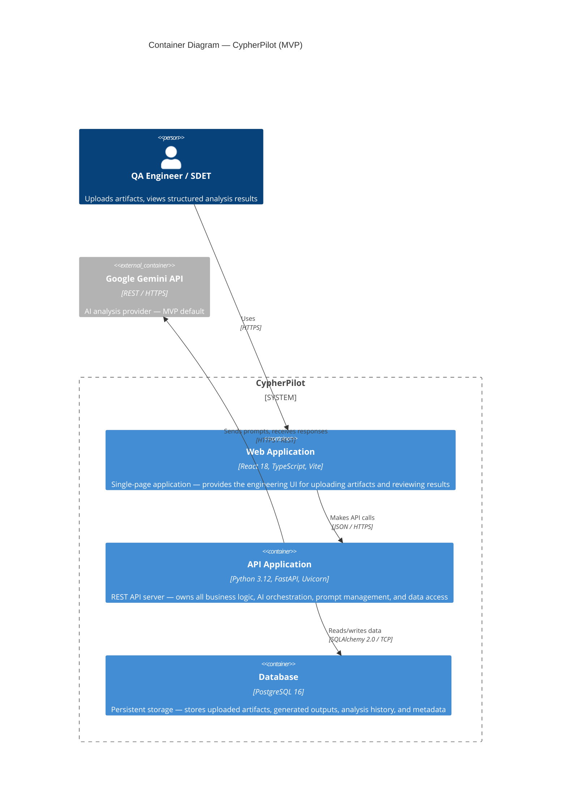

# C4 Level 2 — Container Diagram

> **Purpose:** Show the high-level technical building blocks of CypherPilot — the deployable units (containers) that make up the system, their responsibilities, and how they communicate.
>
> **Audience:** Software engineers, DevOps, tech leads. This is the "technical architecture overview."

---

## Diagram



---

## Container Definitions

### Web Application

| Attribute | Value |
|---|---|
| **Technology** | React 18, TypeScript 5.x, Vite, React Router, Tailwind CSS |
| **Deployment** | Static files served via Nginx or Vite preview within a Docker container |
| **State** | Stateless — all persistent state lives in the backend database |
| **Responsibilities** | Provide artifact upload forms, display structured analysis results, enable copy/export of outputs, manage navigation between modules, render loading/error states |

**What it does:**
- Renders the engineering UI — forms, tables, analysis reports
- Handles file uploads (multipart/form-data) to the API
- Displays structured results (test cases, PyTest code, root-cause reports)
- Provides copy-to-clipboard and export functionality
- Manages client-side routing between modules

**What it does NOT do:**
- ❌ Never calls an AI provider directly
- ❌ Never stores sensitive data (API keys, tokens)
- ❌ Never makes decisions about prompt construction or analysis logic

**Why React + TypeScript + Vite?**
- **TypeScript** — catches entire classes of bugs at compile time. For a portfolio project, it demonstrates type discipline.
- **Vite** — fast dev server, native ES module support, excellent DX. Outpaces Create React App and Webpack for modern SPAs.
- **Tailwind CSS** — utility-first CSS keeps the UI consistent without writing custom CSS. Production-grade and widely adopted.

**Why not Next.js?** CypherPilot is a single-user, self-hosted SPA. Server-side rendering adds complexity (Node.js server, hydration, ISR) with zero benefit for an authenticated (future) dashboard application. A plain SPA served as static files is simpler, faster to build, and easier to deploy.

---

### API Application

| Attribute | Value |
|---|---|
| **Technology** | Python 3.12+, FastAPI, Uvicorn, SQLAlchemy 2.0, Pydantic v2 |
| **Deployment** | Docker container, single Uvicorn process (MVP), multiple workers (future) |
| **State** | Stateless for request handling — all session/entity state in database |
| **Responsibilities** | Expose REST API endpoints, orchestrate AI analysis pipelines, manage prompt templates, validate all inputs/outputs, persist data, handle file storage, enforce business rules |

**What it does:**
- Receives uploaded artifacts and stores them
- Selects and renders the correct prompt template for each analysis type
- Calls the configured AI provider via the provider abstraction
- Parses and validates AI responses against Pydantic models
- Persists analysis history and metadata
- Returns structured responses to the frontend

**Technology decision rationale:**

| Decision | Why |
|---|---|
| **FastAPI** | Native async support, automatic OpenAPI docs, Pydantic integration, excellent performance, widely adopted in production AI/ML platforms |
| **SQLAlchemy 2.0** | The de-facto Python ORM. 2.0 brings modern typing, improved async support, and cleaner query patterns |
| **Pydantic v2** | FastAPI-native, Rust-based core (v2 is 5-50x faster than v1), perfect for AI response validation |
| **Uvicorn** | ASGI server, production-proven, hot-reload for development |

**Why FastAPI over alternatives?**

| Framework | Consideration | Verdict |
|---|---|---|
| **Django** | Heavy, batteries-included, great for full-stack monoliths | ❌ Too much overhead — we don't need admin panel, ORM migrations with Django's ORM, etc. |
| **Flask** | Lightweight, minimal, huge ecosystem | ❌ No native async, no built-in validation, no auto-docs — requires too many bolt-ons |
| **FastAPI** | Async-native, Pydantic-native, auto-docs | ✅ Best fit for an API-first, AI-powered platform |
| **Litestar** | Modern, similar to FastAPI | ❌ Smaller ecosystem, fewer community resources, less hiring signal |

---

### Database

| Attribute | Value |
|---|---|
| **Technology** | PostgreSQL 16 |
| **Deployment** | Docker container, single instance (MVP), read replicas (future) |
| **State** | Stateful — the single source of truth for all persisted data |
| **Responsibilities** | Store uploaded artifacts, analysis inputs/outputs, provider metadata, timestamps, entity relationships |

**What it stores (MVP):**

| Entity | Purpose |
|---|---|
| `analysis_sessions` | Each analysis request — links inputs to outputs across modules |
| `uploaded_artifacts` | Files uploaded by the user (requirements docs, OpenAPI specs, logs) |
| `generated_outputs` | Structured results (test cases, PyTest code, failure analyses) |
| `provider_calls` | Metadata: provider name, model, prompt tokens, response tokens, latency, status |
| `prompt_templates` | (Future) — for MVP, templates are file-based; this is for runtime overrides |

**Why PostgreSQL?**
1. **JSONB support** — AI responses are semi-structured; JSONB allows querying into response fields without separate document storage
2. **Full-text search** — future-proofing for searching across analysis history
3. **Maturity and ecosystem** — Alembic for migrations, pgAdmin for management, extensive community knowledge
4. **Portfolio signal** — PostgreSQL is the industry-standard database for production web applications

**Why not SQLite?** SQLite would be simpler (file-based, no separate service), but:
- No concurrent write support (problematic even for single-user if we add file uploads + AI analysis in parallel)
- Limited JSON support compared to PostgreSQL
- Less portfolio signal — senior engineers expect PostgreSQL knowledge

**Why not a NoSQL option (MongoDB)?** Our data is highly relational (sessions → artifacts → outputs → provider calls). A document database would duplicate data and require application-level joins. PostgreSQL's JSONB gives us the best of both worlds.

---

## Communication Patterns

### Request Flow (Container Level)

```
┌──────────┐     HTTPS/JSON      ┌──────────┐     SQL/TCP      ┌──────────┐
│   Web    │ ──────────────────▶  │   API    │ ───────────────▶ │    DB    │
│   App    │ ◀──────────────────  │   App    │ ◀─────────────── │          │
└──────────┘     JSON Response    └────┬─────┘                  └──────────┘
                                       │
                                       │ HTTPS/REST
                                       ▼
                                ┌──────────────┐
                                │    Google     │
                                │  Gemini API   │
                                └──────────────┘
```

### Key Principles

1. **Frontend never calls AI providers** — all AI communication flows through the API server. This ensures API keys remain server-side and all prompts follow governed templates.

2. **Frontend never accesses the database** — the API is the sole gateway to data. This enforces consistent validation, authorization (future), and audit logging.

3. **API server is stateless** — horizontal scaling is achieved by adding more API instances sharing the same database and file storage.

4. **File upload flow:** Browser → multipart upload → API server → Docker volume (local filesystem for MVP) → database reference.

---

## Alternatives Considered

### Alternative 1: Monolithic Deployment (Single Container)

Instead of three containers (frontend, API, database), we could run everything in a single container.

| Dimension | Monolith | Multi-Container (Chosen) |
|---|---|---|
| **Deployment complexity** | Lower — one container to build and run | Higher — three containers with Docker Compose orchestration |
| **Scaling** | Everything scales together | Each layer scales independently |
| **Technology isolation** | Frontend and backend must share the same process | Each technology stack runs in its native environment |
| **Clear separation of concerns** | Implicit — easy to blur boundaries | Explicit — container boundaries enforce module boundaries |
| **Portfolio signal** | Looks like a prototype | Demonstrates production-grade containerization |

**Decision:** Three containers. Docker Compose is not significantly harder than a single container, and the separation forces good architectural discipline. Running PostgreSQL in its own container is standard practice.

### Alternative 2: FastAPI Serving the React SPA (Rejected)

Instead of a separate frontend container, the FastAPI server could serve the built React static files.

| Dimension | Combined Serving | Separate Frontend Container (Chosen) |
|---|---|---|
| **Deployment** | One container | Two containers + database |
| **Dev workflow** | Must rebuild frontend to see changes | Vite dev server with HMR, separate from backend |
| **Production serving** | Uvicorn serves static files (not its job) | Nginx serves static files efficiently |
| **Separation of concerns** | Backend knows about frontend paths | Backend and frontend are independent deployables |

**Decision:** Separate frontend serving (Nginx in production, Vite dev server in development). Each tool does what it does best.

---

## Security Considerations (MVP)

| Concern | Mitigation |
|---|---|
| **AI API key exposure** | Stored in `.env` file, loaded server-side via `pydantic-settings`. Never sent to the browser. |
| **User-uploaded files** | Stored in Docker volume, not user-accessible filesystem paths. No path traversal risk. No arbitrary file execution. |
| **CORS** | FastAPI CORS middleware configured to allow only the frontend origin. |
| **SQL injection** | Prevented by SQLAlchemy's parameterized queries — no raw SQL construction. |
| **Dependency vulnerabilities** | Regular `pip-audit` or `safety` scans in CI. Dependabot for automated updates. (Future) |

For MVP (single-user, self-hosted, no network exposure), many of these are defense-in-depth rather than active threats. But building security into the architecture from day one is cheaper than retrofitting it.

---

## Container Interaction Rules

These rules govern all container-to-container communication. Every developer must follow them.

```
┌─────────────────────────────────────────────────────────────┐
│                         RULE 1                               │
│  Web Application → API Application (only via REST API)      │
│  No direct database access from the browser.                │
└─────────────────────────────────────────────────────────────┘

┌─────────────────────────────────────────────────────────────┐
│                         RULE 2                               │
│  API Application → Database (only via Repository Layer)     │
│  No raw SQL in business logic. All data access through      │
│  SQLAlchemy repositories.                                   │
└─────────────────────────────────────────────────────────────┘

┌─────────────────────────────────────────────────────────────┐
│                         RULE 3                               │
│  API Application → AI Provider (only via Provider Layer)    │
│  No direct HTTP calls to AI APIs from business logic.       │
│  All calls go through the provider abstraction.             │
└─────────────────────────────────────────────────────────────┘

┌─────────────────────────────────────────────────────────────┐
│                         RULE 4                               │
│  No circular container dependencies.                        │
│  Web App does not depend on Web App.                        │
│  DB does not call the API.                                  │
└─────────────────────────────────────────────────────────────┘
```

---

## Diagram Standards

For consistency across all C4 diagrams in this project:

| Convention | Standard |
|---|---|
| **Diagram order** | Context → Container → Component (decreasing abstraction) |
| **Labeling** | First word capitalized, rest sentence case: "Web Application" not "Web application" |
| **Technology annotations** | Included in the container title on the diagram, detailed in the definition table below |
| **Relationships** | Verb + protocol: "Makes API calls — JSON / HTTPS" |
| **Future elements** | Labeled "Future — " consistently across all diagrams |
| **System boundary** | Only the CypherPilot system has a boundary box. External systems are outside. |

---

## Interview Talking Points

1. **"Why three containers instead of one?"** — Each layer has different lifecycle, scaling, and security requirements. Containers enforce separation of concerns at the process level. PostgreSQL in its own container means we can swap, backup, or scale the database without touching the application. The frontend being separate means we can iterate on UI without redeploying the backend.

2. **"Why not use Django, which gives you all of this in one framework?"** — Django is excellent for full-stack applications where the backend renders HTML. But CypherPilot is an API-first platform with a rich JavaScript frontend. FastAPI gives us async performance, automatic OpenAPI docs, and first-class Pydantic integration — none of which Django excels at without significant bolt-ons.

3. **"How do you handle file storage?"** — For MVP, uploaded artifacts go to a Docker volume (local filesystem). The database stores a reference path and metadata. The actual files never leave the host machine. If we need to scale, we swap the volume for S3/MinIO — the repository pattern for file storage makes this a configuration change.

4. **"What happens if the AI provider is down?"** — The API catches the connection error and returns a structured error response with a clear message. The user sees: "Analysis failed: [provider] returned [error]. Try again or switch providers in Settings." No data loss — the partial analysis session is stored with a `failed` status.

---

## Next Step

Once you've reviewed and approved the Container Diagram, I'll proceed to **C4 Level 3 — Component Diagram**, which opens the API Application container to show the internal modules and their relationships.
