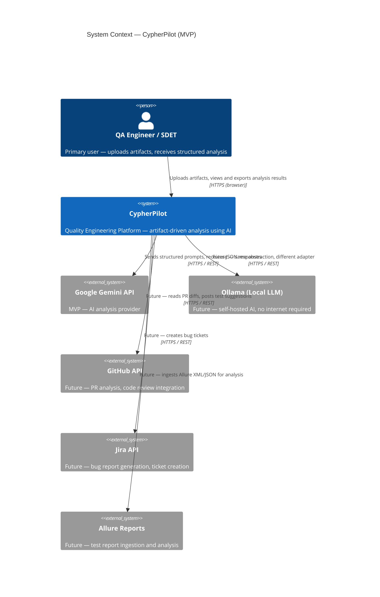

# C4 Level 1 — System Context Diagram

> **Purpose:** Show CypherPilot as a black box — who uses it, what it depends on, and the boundaries of the system.
>
> **Audience:** Technical and non-technical stakeholders. This is the "elevator pitch" of the architecture.

---

## Diagram



> **Diagram Legend:**
> - **Solid boxes** = In-scope for MVP
> - **Dashed boxes** = Post-MVP / future integration
> - The system boundary box encloses everything within CypherPilot's control
>
> *Note: Mermaid renders all `System_Ext` elements identically. The "Future" prefix in labels is the visual convention — see the External Systems table below for the definitive scope classification.*

---

## Element Definitions

### Person: QA Engineer / SDET

| Attribute | Value |
|---|---|
| **Description** | The primary user of CypherPilot. Could be a QA Automation Engineer writing test suites, an SDET debugging pipeline failures, or a manual QA transitioning to automation. |
| **Interaction model** | Uploads artifacts via browser, navigates structured results, copies/exports generated outputs. |
| **Technical context** | Comfortable with Python, PyTest, testing frameworks, and CI/CD concepts. Not necessarily an AI/ML specialist. |

**Why this persona?** The platform is purpose-built for this user. We are not building for product managers, business analysts, or developers who "sometimes write tests." The UX and output formats are optimized for engineers who think in terms of test coverage, edge cases, and automation patterns.

---

### System: CypherPilot

| Attribute | Value |
|---|---|
| **Description** | A self-hosted Quality Engineering Platform that analyzes engineering artifacts and produces structured test artifacts. |
| **Deployment** | Docker Compose (single-machine, self-hosted). Three containers: web frontend, API backend, PostgreSQL database. |
| **Technology** | Python 3.12+ / FastAPI (backend), React + TypeScript + Vite (frontend), PostgreSQL 16 (database). |
| **Key property** | AI is an implementation detail. The platform exposes structured workflows, not a chat interface. |

**System boundary justification:** CypherPilot owns the workflow, storage, and business logic. It delegates AI computation to external providers but controls prompt construction, response parsing, and output validation. This boundary ensures that changing providers does not affect the user experience or the quality of outputs.

---

### External System: Google Gemini API (MVP)

| Attribute | Value |
|---|---|
| **Description** | Google's multimodal AI API. Primary AI provider for MVP development. |
| **Communication** | HTTPS/REST. Prompt sent as structured text, response parsed as JSON. |
| **Authentication** | API key (user-provided, stored in environment configuration). |
| **Free tier** | Yes — generous free quota enables development without paid subscriptions. |
| **MVP scope** | Text-based analysis only (requirements, OpenAPI specs, logs). Screenshot analysis is deferred. |

**Why Gemini for MVP?**
1. **Free tier availability** — aligns with our principle of "no paid AI subscriptions required."
2. **Strong structured output** — Gemini's JSON mode produces reliably parseable responses with proper schema adherence.
3. **Single-provider focus** — building with one provider first reduces integration complexity; the abstraction ensures zero code changes to add more.

**Risk:** Gemini may produce inferior results compared to Claude for certain analysis tasks. Mitigated by the provider abstraction — swapping to Claude is a config change + new adapter class, not a rewrite.

---

### External Systems: Future Integrations

| System | Module | Integration Point |
|---|---|---|
| **Ollama (Local LLM)** | AI Provider (post-MVP) | Local LLM support — no internet required, no API key needed |
| **Claude API** | AI Provider (post-MVP) | Drop-in replacement for Gemini via provider adapter |
| **OpenAI API** | AI Provider (post-MVP) | Same abstraction, different adapter |
| **Allure Reports** | Report Analysis v0.5.0 | Ingest XML/JSON test report files |
| **Jira API** | Bug Generator v0.6.0 | Create tickets via REST API with structured bug reports |
| **GitHub API** | PR Review Assistant v0.8.0 | Read PR diffs via REST API, post comments with test suggestions |

**Design principle:** CypherPilot should never depend on any external system being available. If Gemini is unreachable, the platform should report a clear error, not crash or produce garbage. Every integration is treated as a replaceable adapter.

---

## Communication Patterns

### Request Flow (MVP)

```
QA Engineer                 CypherPilot                  Google Gemini
    │                         │                         │
    │  1. Upload artifact     │                         │
    │────────────────────────>│                         │
    │                         │                         │
    │  2. Validate & store    │                         │
    │  3. Select prompt       │                         │
    │  4. Construct prompt    │                         │
    │                         │  5. Send prompt         │
    │                         │────────────────────────>│
    │                         │                         │
    │                         │  6. Receive response    │
    │                         │<────────────────────────│
    │                         │                         │
    │  7. Parse & validate    │                         │
    │  8. Return structured   │                         │
    │     result              │                         │
    │<────────────────────────│                         │
    │                         │                         │
    │  9. View, copy, export  │                         │
```

**Key observations:**
- CypherPilot is the orchestrator — it controls the entire flow
- The AI provider is a stateless compute resource
- All prompts are constructed server-side from versioned templates
- All responses are validated against Pydantic models before reaching the user
- The user never interacts with the AI provider directly

---

## Alternatives Considered

### Alternative 1: Chat-First Architecture (Rejected)

Instead of structured workflows, we could have built a conversational interface where users describe what they need in natural language and receive responses in a chat window.

| Dimension | Chat-First | Structured (Chosen) |
|---|---|---|
| **User intent clarity** | Ambiguous — must infer from free text | Explicit — form fields define the parameters |
| **Output consistency** | Variable — depends on prompt phrasing | Predictable — validated against schemas |
| **Reproducibility** | Low — same input can yield different outputs | High — same input always follows same pipeline |
| **Integration potential** | Low — chat responses are unstructured | High — structured outputs can be consumed programmatically |
| **Engineering complexity** | Lower (simpler UI) | Higher (forms, validation, pipelines) |
| **Portfolio impact** | Looks like every other AI wrapper | Demonstrates platform engineering |

**Decision:** Structured workflows. CypherPilot is an engineering platform, not a chatbot. The added complexity of structured workflows is a feature, not a bug — it demonstrates engineering rigor.

### Alternative 2: Direct Client-to-AI (Rejected)

The browser could call the AI provider directly, with the backend serving only as a file store.

| Dimension | Direct Client-to-AI | Server-Mediated (Chosen) |
|---|---|---|
| **API key exposure** | Exposed in browser (even with proxy) | Stored server-side, never reaches client |
| **Prompt control** | Client-side, hard to version | Server-side, versioned in git |
| **Response validation** | Client-side, easy to bypass | Server-side, always enforced |
| **Observability** | Limited — no server-side logging | Full — every request is logged |
| **Future auth** | Impossible without rebuild | Natural extension point |

**Decision:** All AI communication goes through the backend. This is non-negotiable — it's the foundation for security, observability, and prompt governance.

---

## Scalability Considerations

For a single-user, self-hosted MVP, scalability is intentionally not a concern. However, the architecture accommodates future growth:

| Concern | Current State | Future Path |
|---|---|---|
| **Concurrent users** | Not supported (no auth) | Add auth → session management → rate limiting |
| **AI provider load** | Serial requests, no caching | Parallel requests, response caching (Redis) |
| **File storage** | Local filesystem (Docker volume) | Object storage (S3/MinIO) |
| **Frontend hosting** | Docker container (static files) | CDN, separate deployment |
| **API scaling** | Single Uvicorn worker | Multiple workers, load balancer |
| **Database** | Single PostgreSQL instance | Read replicas, connection pooling |

The key insight: **we don't optimize for scale until we have users.** But we don't paint ourselves into a corner either — provider abstraction, structured logging, and repository pattern give us escape hatches.

---

## Interview Talking Points

If asked about this diagram in an interview:

1. **"Why only one external dependency for MVP?"** — Deliberate constraint. Every external dependency adds risk, latency, and maintenance cost. Starting with one AI provider (and making it swappable) proves the architecture without over-integrating.

2. **"Why not host AI locally with Ollama?"** — We will! The provider abstraction is designed for it. But for MVP, Gemini's free tier lets us prove the product without asking users to run local models. Ollama support is a configuration change + one new adapter class.

3. **"What about security? API keys in the backend?"** — Yes. All API keys are stored in environment variables, never in code, never in the database. The backend proxies all AI requests so keys are never exposed to the browser. Future phases will add encryption at rest.

4. **"How do you prevent vendor lock-in?"** — The provider abstraction is the answer. Business logic depends on a `BaseProvider` interface, not on any specific provider. Prompts are framework-agnostic Markdown templates. Migrating from Gemini to Claude means writing one new adapter class and changing one config value — zero business logic changes.

---

## Next Step

I'll wait for your review and feedback on this Context Diagram before proceeding to the **Container Diagram (C4 Level 2)** .

**Questions for you:**
1. Does the external system scope feel right? Any integrations you'd add or remove for MVP?
2. Is the "no client-to-AI" stance clear and justified?
3. Are there any external systems you want to call out that I've missed?
